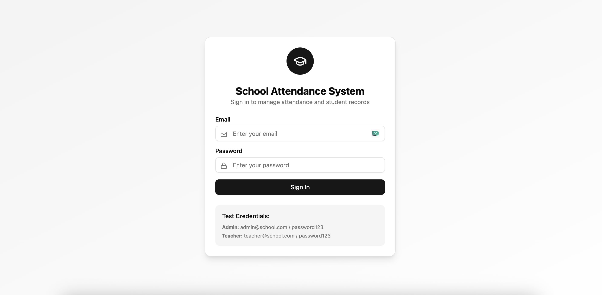
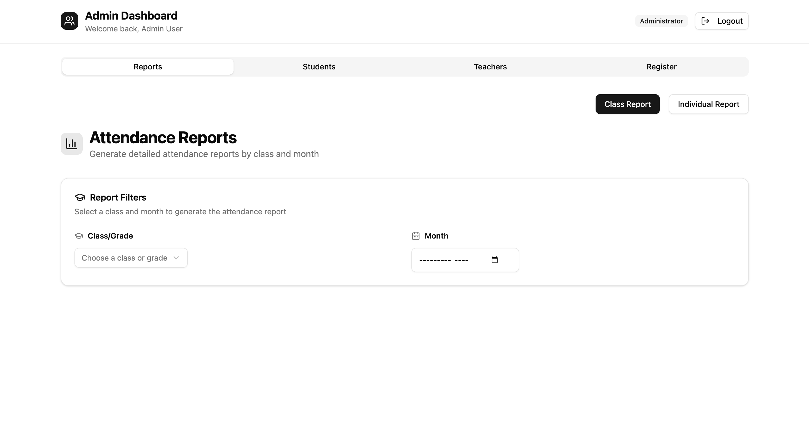
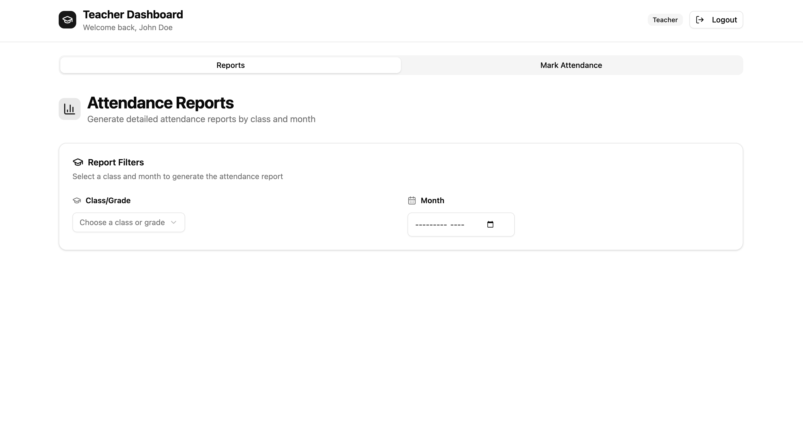
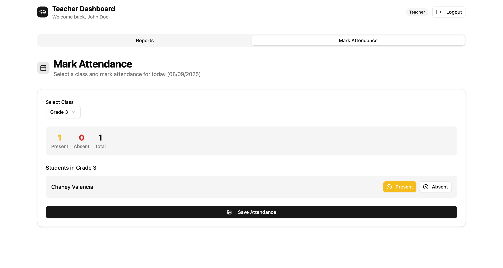
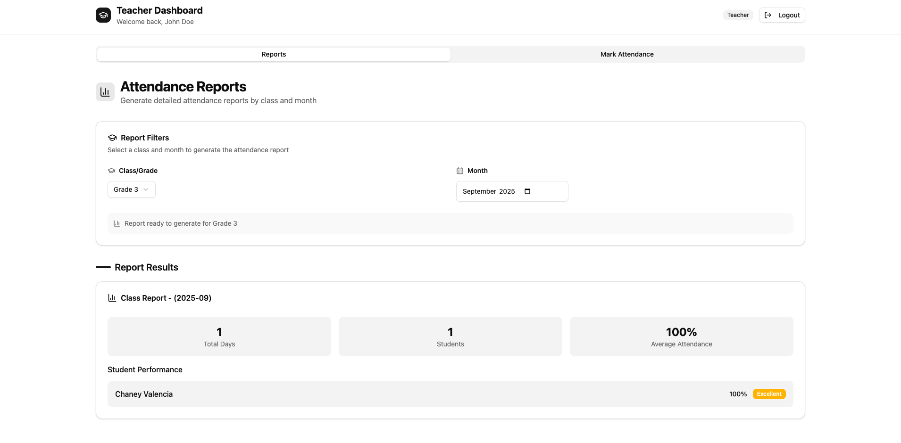

# School Attendance System

A comprehensive web application for managing student and teacher attendance in educational institutions. This full-stack application provides role-based access control, attendance tracking, and reporting features.

## Table of Contents
- [Project Overview](#project-overview)
- [Features](#features)
- [Screenshots](#screenshots)
- [Technical Stack](#technical-stack)
- [Setup Instructions](#setup-instructions)
- [API Documentation](#api-documentation)
- [Test Credentials](#test-credentials)

## Project Overview

The School Attendance System streamlines the process of tracking student attendance across different classes. The system supports two user roles:

- **Administrators** can register students and teachers, and access comprehensive attendance reports.
- **Teachers** can mark daily attendance for their assigned classes and view attendance reports for their classes.

## Features

### User Authentication & Role Management
- Secure login and authentication system
- Role-based access control (Admin and Teacher roles)
- Password protection and token-based authentication

### User Management (Admin Only)
- Register and manage students:
  - Student name
  - Class/Grade assignment
- Register and manage teachers:
  - Teacher name
  - Email and secure password
  - Role assignment
- View and filter lists of students and teachers

### Class Management [To be implemente]
- Create and manage class groups
- Assign students to specific classes
- View class rosters and information

### Attendance Tracking
- Mark students as Present or Absent
- Daily attendance recording
- Prevention of duplicate attendance entries
- Date-based attendance management

### Reporting and Analytics
- **Individual Student Reports:**
  - Chronological list of attendance records
  - Summary statistics (total days, present days, absent days)
  - Attendance percentage calculation
- **Class Reports:**
  - Monthly attendance summaries by class
  - Attendance trends and patterns
  - Exportable reports

## Screenshots

### Login Screen


### Admin Dashboard


### Teacher Dashboard


### Attendance Marking


### Student Reports


## Technical Stack

### Backend
- **Framework:** Laravel 12.x (PHP 8.2+)
- **Authentication:** Laravel Sanctum
- **Database:** MySQL
- **API:** RESTful API endpoints

### Frontend
- **Framework:** React 19.x with TypeScript
- **State Management:** Redux Toolkit
- **Routing:** React Router v7
- **UI Components:** Tailwind CSS with Shadcn UI
- **Form Handling:** React Hook Form with Zod validation

### Development Tools
- **Package Managers:** Composer (PHP), npm (JavaScript)
- **Build Tool:** Vite
- **Version Control:** Git

## Setup Instructions

### Prerequisites
- PHP 8.2 or higher
- Composer
- Node.js 18.x or higher
- npm or yarn
- MySQL or compatible database

### Installation

1. **Clone the repository:**
   ```bash
   git clone https://github.com/wandanamaddumage/school-attendance-system.git
   cd school-attendance-system
   ```

2. **Backend Setup:**
   ```bash
   # Navigate to server directory
   cd server
   
   # Install PHP dependencies
   composer install
   
   # Create environment file
   cp .env.example .env
   
   # Configure your database in .env file
   # DB_CONNECTION=mysql
   # DB_HOST=127.0.0.1
   # DB_PORT=3306
   # DB_DATABASE=school_attendance
   # DB_USERNAME=root
   # DB_PASSWORD=
   
   # Generate application key
   php artisan key:generate
   
   # Run database migrations and seeders
   php artisan migrate --seed
   
   # Start the Laravel development server
   php artisan serve
   ```

3. **Frontend Setup:**
   ```bash
   # Navigate to frontend directory
   cd ../frontend
   
   # Install JavaScript dependencies
   npm install
   
   # Create environment file
   cp .env.example .env
   
   # Start the React development server
   npm run dev
   ```

4. **Access the application:**
   - Backend API: [http://localhost:8000](http://localhost:8000)
   - Frontend: [http://localhost:5173](http://localhost:5173)

## API Documentation

You can explore and test the API using **Postman**:

1. Start the backend server.
2. Locate the API JSON file at: /server/postman_collection.json


## Test Credentials

After running the database seeders, you can use the following credentials to log in:

### Admin User
- **Email:** admin@school.com 
- **Password:** password123

### Teacher User
- **Email:** teacher@school.com 
- **Password:** password123

---

   
